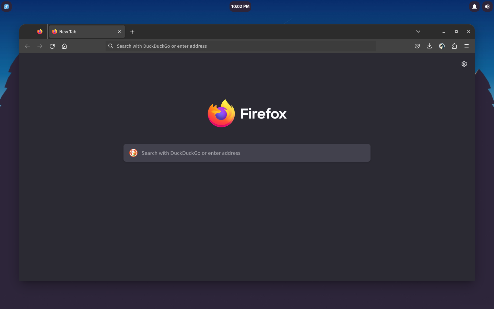
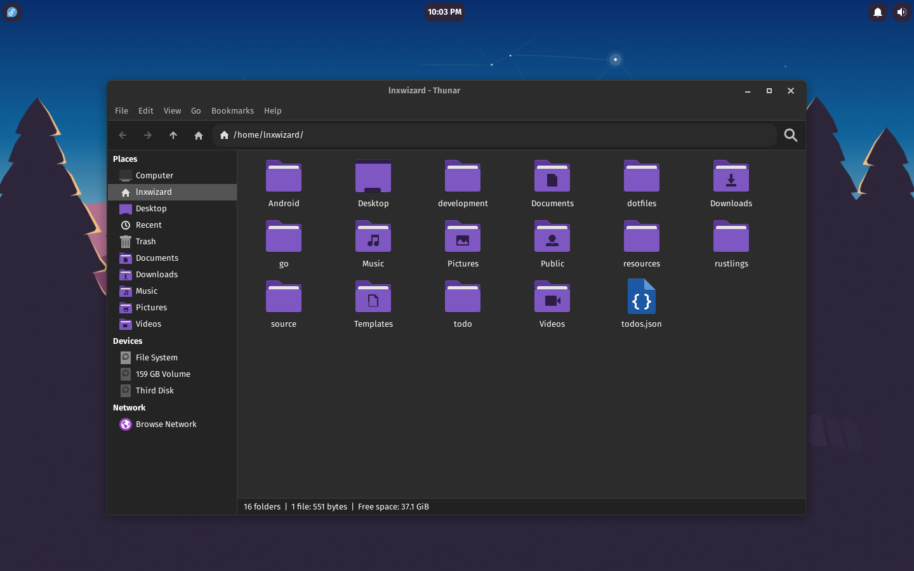
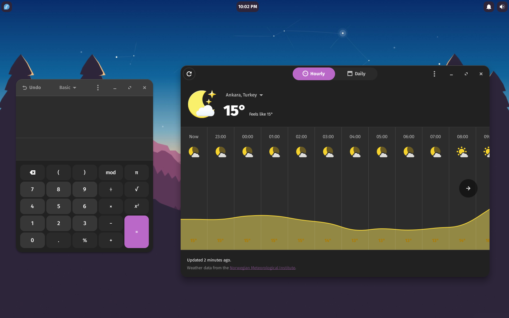

# Orchis Purple Dark

### Details:

**Distro**: [Fedora](https://fedoraproject.org/)

**DE**: [Xfce](https://xfce.org)

**Wallpaper**: [Sunset Flat](https://wallpapersafari.com/w/0MOwvY)

**Theme**: [Orchis Purple Dark](https://github.com/vinceliuice/Orchis-theme)

**WM Theme**: [Orchis Purple Dark](https://github.com/vinceliuice/Orchis-theme)

**Icon Theme**: [Papirus Dark Violet](https://github.com/PapirusDevelopmentTeam/papirus-icon-theme)

**Terminal**: [GNOME Terminal](https://github.com/GNOME/gnome-terminal)

**Panel**: [Xfce4-Panel (Customized)](https://github.com/xfce-mirror/xfce4-panel)

**Default Font**: [Fira Sans Regular](https://fonts.google.com/specimen/Fira+Sans?query=fira+sans)

**Default Monospace Font**: [Fira Mono Regular](https://fonts.google.com/specimen/Fira+Mono?query=fira+mono)

**Windows Title Font**: [Fira Sans SemiBold](https://fonts.google.com/specimen/Fira+Sans?query=fira+sans)

**Terminal Font**: [Fira Mono](https://fonts.google.com/specimen/Fira+Mono?query=fira+mono)

**Apps**:
    - [GNOME Calculator](https://github.com/GNOME/gnome-calculator)
    - [GNOME Weather](https://github.com/GNOME/gnome-weather)
